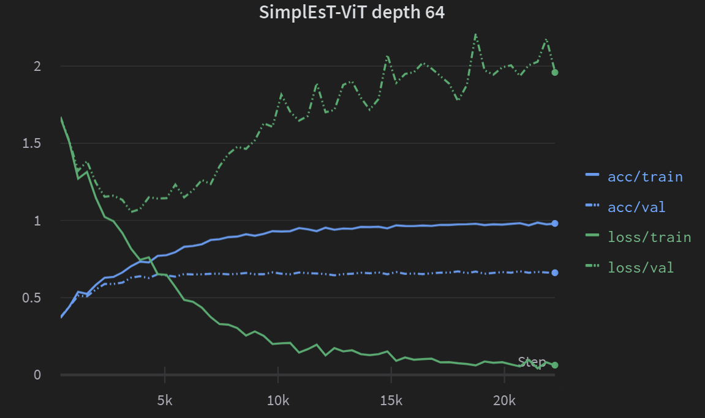

# SimplEsT-ViT
Simpl**E**s**T**-ViT (**E**-SPA + **T**AT) - vanilla transformer (without normalizations and skip connections), E-SPA (gama = 0.005) + TAT (eta = 0.9).

## Table of Contents:
1. [Dependencies](#Dependencies)
2. [Data](#Data)
    1. [TinyImageNet200](#TinyImageNet200)
    2. [ImageNet-1k](#ImageNet-1k)
3. [Results](#Results)
    1. [TAT setup](#TAT-setup)
    2. [SimpleViT setup](#SimpleViT-setup)
    3. [Trainability of deeper SimplEsT-ViT](#Trainability-of-deeper-SimplEsT-ViT)
4. [Experiments setup](#Experiments-setup)
    1. [Shampoo implementation discusion](#Shampoo-implementation-discusion)
    2. [Acknowledgment](#Acknowledgment)
5. [ImageNet-1k Results](#ImageNet-Results)
6. [References](#References)


## Dependencies:
* pytorch 2.0
* wandb (optional)

## Data:

### TinyImageNet200:
The dataset contains 110 000 images of 200 classes downsized to 64x64 colored images. Each class has 500 training images (100 000), 50 validation images (10 000).

1. Run downloand_tiny_imagenet.py
    ```bash
    python3 downloand_tiny_imagenet.py -r data
    ```

### ImageNet-1k:
1. Go to https://www.image-net.org/download.php
2. Request to download ImageNet 
3. Create data folder if not alredy exist
    ```bash 
    mkdir -p data
    ```
4. Move to data folder 
    ```bash
    cd data
    ``` 
5. Download the images from the ILSVRC2012 page
    1. Training images (Task 1 & 2) 138 GB 
        ```bash 
        wget https://image-net.org/data/ILSVRC/2012/ILSVRC2012_img_train.tar
        ```
    2. Validation images (all tasks) 6.3 GB
        ```bash 
        wget https://image-net.org/data/ILSVRC/2012/ILSVRC2012_img_val.tar
        ```
6. Run the script extract_ILSVRC.sh from the PyTorch GitHub, [extract_ILSVRC.sh](https://github.com/pytorch/examples/blob/main/imagenet/extract_ILSVRC.sh) (~ double memory) 
    ```bash
    wget -qO- https://raw.githubusercontent.com/pytorch/examples/main/imagenet/extract_ILSVRC.sh | bash
    ```


## Results:

### **TAT setup:**
|                |        | Cifar10 (/4) | Cifar100 (/4) | TinyImageNet200 (/8) 
| :---            | :---    | :---:       | :---:      | :---: |
| SimpleViT-S    | Adam   |  0.8334  |   0.5880      | 0.4529|
| SimplEsT-ViT-S | <p> Adam <p> Shampoo@25 | <p>0.7936 <p>0.8243 |  <p>0.4687 <p>0.5506 | <p>0.3847 <p>0.4208|
* TAT setup: label smoothing + dropout  + weight decay.

### **SimpleViT setup:**
|                |        | Cifar10 (/4)   | Cifar100 (/4) | TinyImageNet200 (/8) 
| :---            | :---    | :---:       | :---:      | :---: |
| SimpleViT-S    | Adam   |  0.8733   |   0.6439      | 0.5152|
| SimplEsT-ViT-S | <p> Adam <p> Shampoo@25 | <p>0.7894 <p>0.8496 |  <p>0.4776 <p>0.5899 | <p>0.3966 <p>0.4490 |
* SimpleViT setup: randaugment + mixup + weight decay.

Training for three times longer with Adam matches the SimpleViT-S training loss. In the E-SPA paper, they showed results for training five times longer, but those were from large-scale experiments. However, achieving high validation accuracy is a different story ...

As mentioned in the TAT and DKS papers, "second-order methods" can significantly boost performance. However, it has not been validated for the Transformer architecture (E-SPA).

* Shampoo@25 was ~1.25x slower than Adam.
* The ViT (-S) architecture naming convention can be found [here](https://github.com/google-research/big_vision/blob/main/big_vision/models/vit.py#L248).
* /4 means patch size 4x4, /8 means patch size 8x8.
### **Trainability of deeper SimplEsT-ViT:**
<figcaption>Model was trained on Cifar10 with Adam optimizer.</figcaption>

One block of SimplEsT-ViT consists of one attention layer (without projection) and 2 linear layers in the MLP block. Thus, the "effective depth" is 64 * 3 + 2 = 194 (2 = patch embedding + classification head). It is impressive to train such a deep vanilla transformer only with proper initialization.

## Experiments setup:
* Epochs: 90
* WarmUp: 75 steps
* Batch size: 2048
* Gradient cliping: 1 
* Learning scheduler: Cosine with linear wurmup

* Dropout: {0, 0.2}
* Weight decay: {0, 0.00005}

* Optimizer: 
    * Adam, Learning rate:
        * SimplEsT-ViT - {0.0005, 0.0003} 
        * SimpleViT - 0.001
    * Shampoo, Learning rate:
        * SimplEsT-ViT - {0.0007, 0.0005} 

* Tat setup: 
    * Label smoothing: 0.1
    * Dropout: {0, 0.2}

* ViT setup:
    * RandAugment: level 10
    * Mixup: probability 0.2

It would be beneficial to perform a wider range of experiments to determine the optimal learning rate and weight decay values, particularly for weight decay. This is especially relevant given that the normalization achieved through [LN makes the network scale-invariant](https://arxiv.org/pdf/1607.06450.pdf), resulting in a weight decay [exhibiting distinct behavior](https://www.cs.toronto.edu/~rgrosse/courses/csc2541_2022/readings/L05_normalization.pdf) compared to networks without normalization. We hypothesize that weight decay should be considerably lower than for SimpleViT.

### Shampoo implementation discusion:
We use the same [implementation for Shampoo](https://github.com/facebookresearch/optimizers/tree/main/distributed_shampoo) (except [one small change](https://github.com/richardcepka/SimplEsT-ViT/commit/de7608ce3f3ea1031f326a54e4aba9d83a2ffa41)) as in the Cramming paper, where they show no benefits. They hypothesize that it may be due to [improper implementation](https://twitter.com/_arohan_/status/1608577721818546176). However, based on my understanding, the discussion is about the Newton iteration method, which is not used as default in the Shampoo implementation we use (default is eigendecomposition).

We also tried Newton's method with the tricks mentioned [here](https://twitter.com/_arohan_/status/1608577721818546176). Nevertheless, most of the time, Newton's method didn't converge. Performance was more or less the same (or worse) as eigendecomposition, and it was slower too. That's why, we stick with eigendecomposition.

### Acknowledgment: 
I want to thank KInIT for supporting the training costs of experiments. All experiments were done on RTX 3090.

## ImageNet-1k Results:
|                       |                               |    90 epoch    | 
| :---                  |   :---                        |      :---:     | 
| SimplEsT-ViT-S/16[^1] |   <p> TAT setup <p> ViT setup | <p>0.7053 <p>0.7071|


It is important to mention that we were unable to conduct a parameter sweep due to computational limitations. Instead, we tested three different learning rates - specifically, 0.0007, 0.0005, and 0.0003. However, we found that the first two led to divergence. Therefore, we believe our present results have room for further improvement.

Hyperparameters:
* Epochs: 90
* WarmUp: 10 000 steps
* Batch size: 1024
* Gradient cliping: 1
* Learning scheduler: Cosine with linear wurmup
* Optimizer: Shampoo@25
* Learning rate: 0.0003
* Weight decay: 0.00001

    Tat setup: 
    * Label smoothing: 0.1
    * Dropout: 0.2

    ViT setup:
    * RandAugment: level 10
    * Mixup: probability 0.2


## References: 
* E-SPA - [Deep Transformers without Shortcuts: Modifying Self-attention for Faithful Signal Propagation ](https://openreview.net/forum?id=NPrsUQgMjKK)
* TAT - [Deep Learning without Shortcuts: Shaping the Kernel with Tailored Rectifiers](https://arxiv.org/abs/2203.08120)
* DKS - [Rapid training of deep neural networks without skip connections or normalization layers using Deep Kernel Shaping](https://arxiv.org/abs/2110.01765)
* SimpleViT - [Better plain ViT baselines for ImageNet-1k](https://arxiv.org/abs/2205.01580)
* Cramming - [Cramming: Training a Language Model on a Single GPU in One Day](https://arxiv.org/abs/2212.14034)
* Shampoo - [Shampoo: Preconditioned Stochastic Tensor Optimization](https://arxiv.org/abs/1802.09568), [Scalable Second Order Optimization for Deep Learning](https://arxiv.org/abs/2002.09018)
* Adam - [Adam: A Method for Stochastic Optimization](https://arxiv.org/abs/1412.6980)

[^1]: ~20 M parameters.